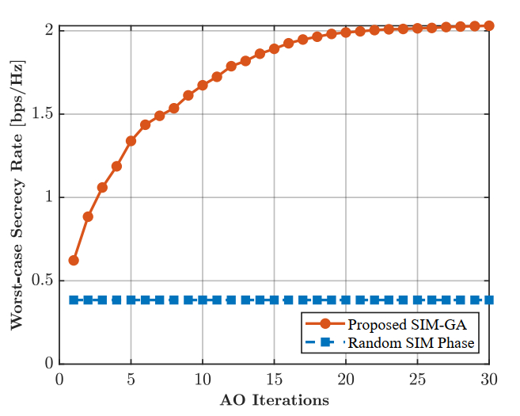
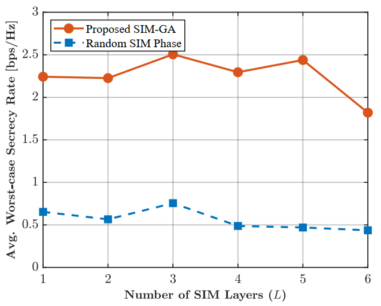
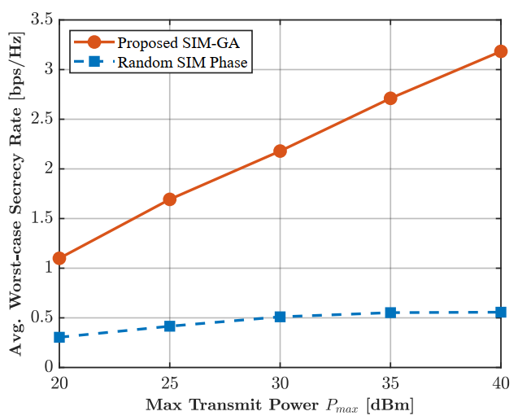
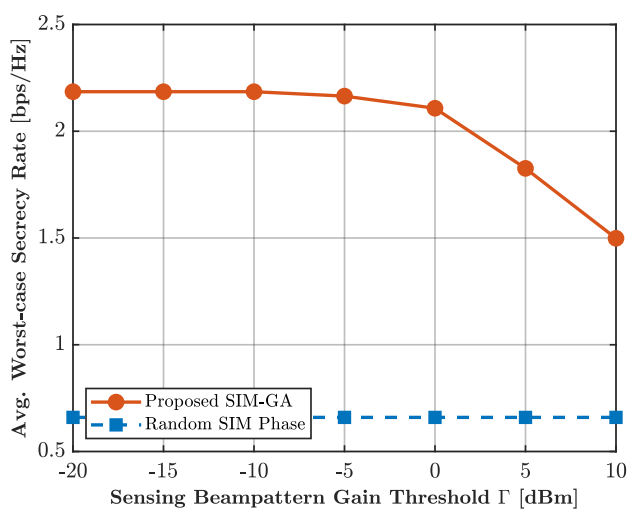

# Stacked Intelligent Metasurfaces (SIM) for Secure ISAC Systems

This repository contains the MATLAB implementation and supporting documents for the research paper: **"Stacked Intelligent Metasurfaces for Enhanced Secrecy in Integrated Sensing and Communication Systems."**

## Overview
This project investigates the application of Stacked Intelligent Metasurfaces (SIM) in Integrated Sensing and Communication (ISAC) systems. We propose a joint optimization framework for transmit beamforming and SIM phase shifts to enhance the secrecy rate of the communication system while maintaining the sensing beampattern requirements.

## Key Features
- **Joint Optimization:** Implements a joint optimization approach using Successive Convex Approximation (SCA) for beamforming and Gradient Ascent (GA) for SIM phase shifts.
- **Performance Evaluation:** Evaluates the system's worst-case secrecy rate (WSR) across 4 scenarios:
  - **Part 1:** Convergence analysis of the algorithm.
  - **Part 2:** Impact of SIM layer depth ($L$).
  - **Part 3:** Impact of maximum transmit power ($P_{max}$).
  - **Part 4:** Impact of sensing beampattern gain threshold ($\Gamma$).
- **Baseline Comparison:** Automated comparison between the proposed design and a random SIM phase baseline.

## Repository Structure
- `/output/`: Stores simulation results (`.mat`) and exported figures (`.pdf`).
- `/SIM_ISAC_config_Secrecy.m`: System configuration file (contains all simulation parameters).
- `Research___Secrecy_SIM_ISAC__Conference.pdf`: The full research paper accompanying this code.
- `Main_P*.m`: Main scripts for the four simulation parts.
- `Optimize_*.m`: Optimization algorithms (SCA and GA).
- `Plot_Results_Secrecy.m`: Visualization script for generating results.

## Requirements
- **MATLAB**
- **CVX Toolbox** (with **MOSEK** solver installed for optimal convex optimization results).

## How to Run
1. **Configure:** Open `SIM_ISAC_config_Secrecy.m` to adjust system parameters (number of antennas, iterations, layers, etc.).
2. **Execute:** Run the `Main_P*.m` files sequentially to generate data for each scenario.
3. **Visualize:** Run `Plot_Results_Secrecy.m` to automatically process the output data and generate professional plots in the `/output/figure/` directory.

## Simulation Results
The following figures illustrate the performance of the proposed SIM-ISAC system under various parameters:

**Convergence Analysis**  
**Impact of SIM Layers**  
  


**Transmit Power Impact**  
**Sensing Threshold Impact**  
  


## Citation
If this work assists your research, please cite:
```bibtex
@article{NguyenCaoTruong_ISAC_SIM,
  title={Stacked Intelligent Metasurfaces for Enhanced Secrecy in Integrated Sensing and Communication Systems},
  author={Nguyen Cao Truong et al.},
  year={2026}
}
